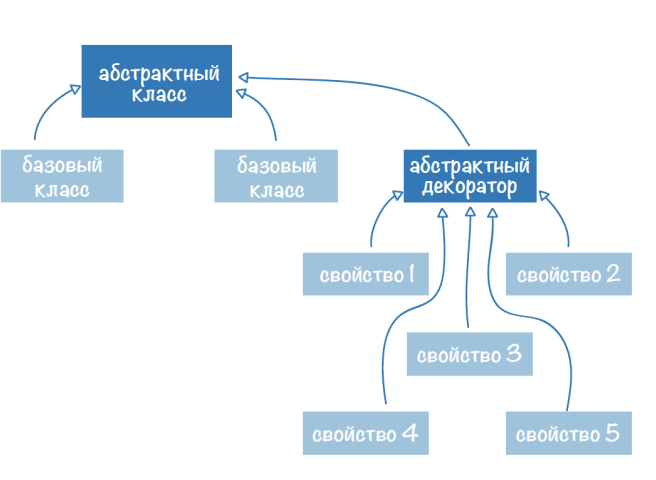
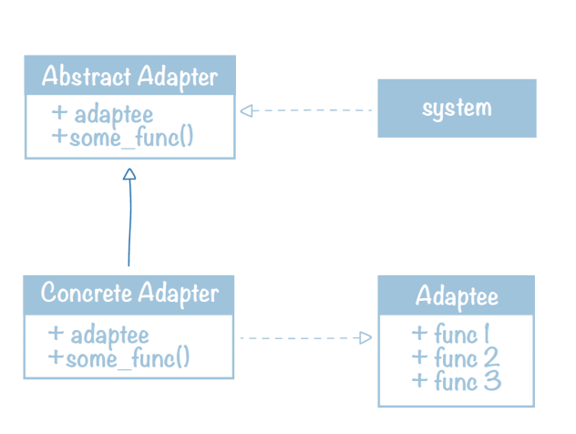
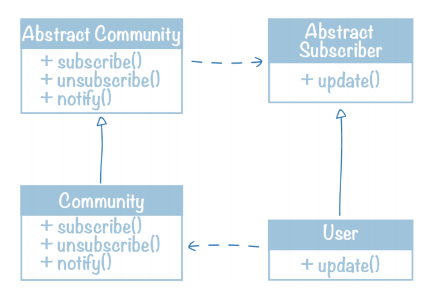

## Классификация паттернов проектирования

**Паттерн проектирования(Design Pattern)** - повторяемая архитектурная конструкция, 
применяемся для решения часто встречающихся задач

### Классификация паттернов по уровню абстракции
* Низкоуровневые паттерна (идиомы)
    * Тернарный оператор: result = true_val if condition else false_val
    * new_list = [f(x) for x in iterable if condition]    
    
* Паттерны проектирования
* Ахитектурные паттерны
    * Model-View-Controller (MVC)
    * Model-View-Presenter
    * Model-View-View Model
    * Presentation-Abstraction-Control
    * Naked Object
    * Hierarchical Model-View-Controller
    * View-Interactor-Presenter-Entity-Routing (VIPER)
    
### Виды паттернов проектирвоания
* Структурные паттерны - модифицируют структуру объектов
    * Adapter(адаптер) - взимодействие несовместимых объектов
    * Bridge(мост) - разделение абстракции и реализации
    * Composite(компоновщик) - агрегирование нескольких объектов в одну структуру
    * Decorator(декоратор) - динамическое создание дополнительного поведения объекта
    * Facade(фасад) - сокрытие сложной стуктуры за одним объектом, являющимся общей точкой доступа 
    * Flyweight(приспособленец) - общий объект, имеющий различные свойства в разных местах программы
    * Proxy(заместитель) - контроль доступа к некоторому объекту
* Порождающие паттерны - используются при создании различных объектов. Нужны для разделения создания объекта
    и использования его системой
    * Abstract Factory(абстрактная фабрика) - создание семейств взаимосвязанных объектов
    * Builder(строитель) - сокрытие инициализации для сложного объекта
    * Factory Method(фабричный метод) - общий интерфейс создания экземпляров подклассов некотрого класса
    * Lazy Initialization(отложенная инициализация) - создание объекта только при доступе к нему
    * Multiton(пул одиночек) - повторное использование сложных объектов вместо его создания
    * Object Pool(объектный пул)
    * Prototype(прототип) - упрощение создания объекта за счет клонирования уже имеющегося
    * Singleton(синглтон) - объект, присутсвующий в системе в единственном экземпляре
* Поведенческие паттерны - описывают способы реализации взаимодействия между объектами различных типов
    * Chain Of Responsibility(цепочка обязанностей) - обработка данных несколькими объектами
    * Interpreter(интерпретатор) - решение частой незначительно меняющейся задачи
    * Iterator(итератор) - последовательный доступ к объекту-коллекции
    * Memento(хранитель) - сохранение и восстановление объекта
    * Observer(наблюдатель) - оповещение об изменении некоторого объекта
    * State(состояние) - изменение поведения в зависимости от состояния объекта
    * Strategy(стратегия) - выбор из нескольких вариантов поведения объекта
    * Visitor(постетитель) - выполнение некоторой операции над группой различных объектов
* Конкурентные паттерны - применяются в параллельном программировании. 
Они используются для реализации взаимодействия различных процессов и потоков
    * Lock(блокировка) - позволяет потоку захватывать общие ресурсы на период выполнения
    * Monitor(монитор) - механизм синхронизации и взаимодействия процессов, обеспечивающий доступ к общим неразделяемым ресурсам
    * Scheduler(Планировщик) - позволяет планировать порядок выполнения парарллельных процессовс учетом приоритетов и ограничений
    * Active Object(Активный объект) - позволяет отделять поток выполнения некотрого метода от потока, в котором данный метод был вызван

## Паттерн Декоратор

Задача паттерна: изменение классического поведения базового класса

Для создания паттерна декоратор нужно: (дописать про base class)
* Абстрактный базовый класс (от него будут наследоваться конкретные реализации)
* Класс-декторатор (описывает дополнительную функциональность базового абстрактного класса, 
принимает базовый объект, который нужно отдекарировать)



Пример реализации: 
```python
from abc import ABC, abstractmethod


class AnimalCreator(ABC):
    @abstractmethod
    def feed(self):
        pass

    @abstractmethod
    def move(self):
        pass

    @abstractmethod
    def make_noise(self):
        pass


class Animal(AnimalCreator):
    def feed(self):
        print("I eat grass")

    def move(self):
        print("I walk forward")

    def make_noise(self):
        print("WOOO!")


class AbstractDecorator(AnimalCreator):
    def __init__(self, base):
        self.base = base

    def feed(self):
        self.base.feed()

    def move(self):
        self.base.move()

    def make_noise(self):
        self.base.make_noise()


class Swimming(AbstractDecorator):
    def move(self):
        print("I swim forward")

    def make_noise(self):
        print("...")


class Predator(AbstractDecorator):
    def feed(self):
        print("I eat other animals")


class Fast(AbstractDecorator):
    def move(self):
        self.base.move()
        print("Fast!")


if __name__ == "__main__":
    animal = Animal()
    swimming = Swimming(animal)
    print("I'm a swimming animal")
    swimming.move()
    swimming.feed()
    swimming.make_noise()
    predator = Predator(swimming)
    print("I'm a swimming predator")
    predator.move()
    predator.feed()
    predator.make_noise()
    faster_predator = Fast(Fast(predator))
    print("I'm a faster swimming predator")
    faster_predator.move()
    faster_predator.feed()
    faster_predator.make_noise()
    faster_predator.base.base = faster_predator.base.base.base  # снимаем эффект хищника
    faster_predator.move()
    faster_predator.feed()
    faster_predator.make_noise()

```

## Паттерн Адаптер

Паттерн Адаптер относится к классу структурных. Пусть есть объект и система, в которую должен быть встроен данный объект.
Адаптер обеспечивает интерфейс, с помощью которого исходный объект может взаимодействовать с системой
К структуре паттерна Адаптер относятся только базовый объект, адаптируемый, и сам адаптер.

### Структура Адаптера



Для создания адаптера необходима система и адаптируемый объект. Система взаимодействует с объектом, имеющим интерфейс Target. 
Адаптер реализует этот интерфейс и взаимодействует с адаптируемым объектом.

Пример реализации: 
```python
import re
from abc import ABC, abstractmethod


text = """
Design Patterns: Elements of Reusable Object-Oriented Software is a software engineering book describing 
software design patterns. The book's authors are Erich Gamma, Richard Helm, Ralph Johnson and John Vlissides with a 
foreword by Grady Booch. The book is divided into two parts, with the first two chapters exploring the capabilities 
and pitfalls of object-oriented programming, and the remaining chapters describing 23 classic software design patterns. 
The book includes examples in C++ and Smalltalk. It has been influential to the field of software engineering and is 
regarded as an important source for object-oriented design theory and practice. More than 500,000 copies have been sold 
in English and in 13 other languages. The authors are often referred to as the Gang of Four (GoF).
"""


class System:
    def __init__(self, text):
        tmp = re.sub(r'\W', ' ', text.lower())
        tmp = re.sub(r' +', ' ', tmp).strip()
        self.text = tmp

    def get_processed_text(self, processor):
        result = processor.process_text(self.text)
        print(*result, sep="\n")


class TextProcessor(ABC):

    @abstractmethod
    def process_text(self, text):
        pass


class WordCounter:

    def count_words(self, text):
        self.__words = dict()
        for word in text.split():
            self.__words[word] = self.__words.get(word, 0) + 1

    def get_count(self, word):
        return self.__words.get(word, 0)

    def get_all_words(self):
        return self.__words.copy()


class WordCounterAdapter(TextProcessor):
    def __init__(self, adaptee):
        self.adaptee = adaptee

    def process_text(self, text):
        self.adaptee.count_words(text)
        words = self.adaptee.get_all_words().keys()
        return sorted(words, key=lambda x: self.adaptee.get_count(x), reverse=True)


if __name__ == "__main__":
    system = System(text=text)
    counter = WordCounter()
    adapter = WordCounterAdapter(counter)
    system.get_processed_text(adapter)
```


## Паттерн Наблюдатель (Observer)

Относится к поведенческим паттернам. Задача: оповещение об изменении некотрого объекта. 
Наблюдаемый объект самостоятельно ставит в известность наблюдателей об изменениях (push-система отслеживания изменений).



Пример реализации: 
```python
from abc import ABC, abstractmethod


class NotificationManager:  # менеджер, который умеет рассылать сообщения подписчикам

    def __init__(self):
        self.__subscribers = set()

    def subscribe(self, subscriber):
        self.__subscribers.add(subscriber)

    def unsubscribe(self, subscriber):
        self.__subscribers.remove(subscriber)

    def notify(self, message):
        for subscriber in self.__subscribers:
            subscriber.update(message)


class AbstractObserver(ABC):

    @abstractmethod
    def update(self, message):
        pass


class MessageNotifier(AbstractObserver):
    def __init__(self, name):
        self.__name = name

    def update(self, message):
        print(f"{self.__name} received message!")


class MessagePrinter(AbstractObserver):
    def __init__(self, name):
        self.__name = name

    def update(self, message):
        print(f"{self.__name} received message: {message}")


if __name__ == "__main__":
    notifier = MessageNotifier("Notifier1")
    printer1 = MessagePrinter("Printer1")
    printer2 = MessagePrinter("Printer2")

    manager = NotificationManager()
    manager.subscribe(notifier)
    manager.subscribe(printer1)
    manager.subscribe(printer2)

    manager.notify("Hello from manager")

```